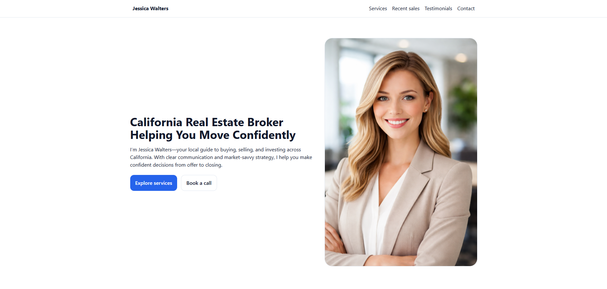
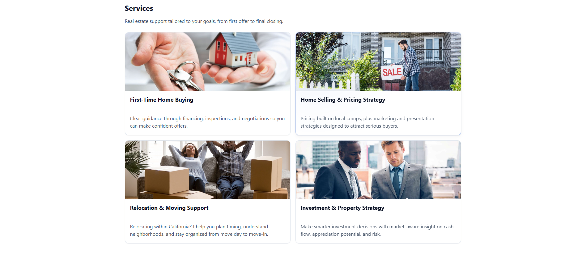
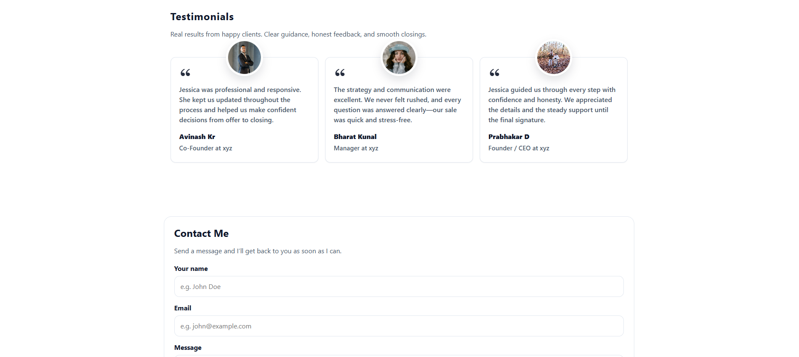

# Portfolio (Vanilla HTML, CSS & JavaScript)

This is a basic, static portfolio website built with **lightweight HTML**, **modern CSS** (CSS variables, responsive layout, and accessible patterns), and **minimal vanilla JavaScript** (no frameworks).

## Screenshots

## What’s included

- `index.html` – the main portfolio page
- `css/base.css` – site styling using a modern, variable-driven approach
- `js/main.js` – small vanilla JS enhancement (e.g. dynamic year)

## How to use

Open `index.html` in your browser. No build step is required.
